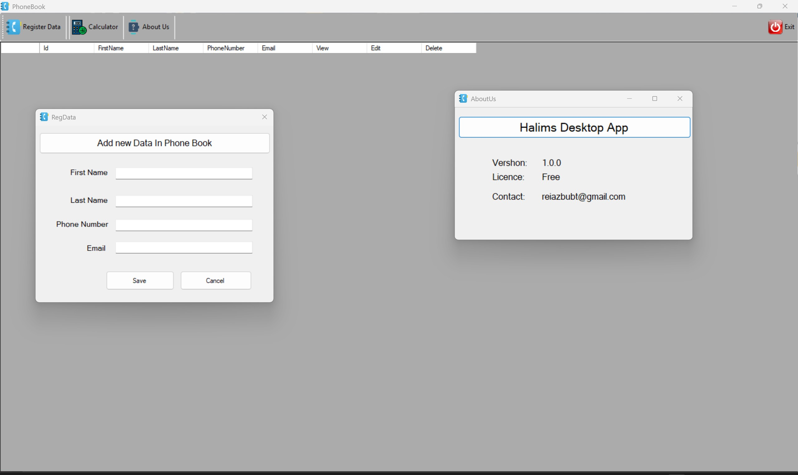

# 📇 PhoneBook Desktop Application

A lightweight and intuitive desktop application built using **C# Windows Forms** that allows users to store, update, and manage contact information such as names, phone numbers, and email addresses. Ideal for personal or small office use.

---

## ✨ Features

✅ Add new contacts with name, phone, and email  
✅ Edit existing contact details  
✅ Delete contacts with confirmation  
✅ Validate email and phone number formats  
✅ Save and load contacts from JSON file  
✅ Simple and clean user interface  

---

## 💻 Technologies Used

- **Language:** C#  
- **Framework:** .NET Framework  
- **GUI:** Windows Forms  
- **Data Storage:** JSON file using `Newtonsoft.Json`

---

## 📁 Folder Structure

> ✅ Make sure `Newtonsoft.Json.dll` is placed in the same folder as `PhoneBook.exe`.

---

## 🛠 How to Run

1. Open the project in **Visual Studio**
2. Build the solution (Ctrl + Shift + B)
3. Navigate to the `bin\Release` folder
4. Double-click `PhoneBook.exe` to launch the app  
5. Use the interface to add, edit, or delete contacts

---

## 📷 Screenshot

---

## 📜 License

This project is intended for educational and personal use.  
© 2025 Halim Mohammad Abdul. All rights reserved.

---

## 🙌 Author

Developed by **Halim Mohammad Abdul**  
📧 Email: reiazbubt@gmail.com  
🌐 GitHub: [halimmdabdul](https://github.com/halimmdabdul)

